# Personal Anime Assistant

An AI-powered personal anime assistant with a complete data pipeline for ingesting, processing, and analyzing anime data. Features a multi-agent system using AutoGen and GPT-4o-mini for intelligent conversations about anime recommendations, watch tracking, and discovery.

## 🎌 Quick Start

1. **Setup Environment**:
   ```bash
   # Add your OpenAI API key to .env
   echo "OPENAI_API_KEY=your_key_here" >> .env
   
   # Generate personal watch history
   poetry run python personal_watch_history.py
   ```

2. **Launch Chat Interface**:
   ```bash
   # Web UI (Streamlit)
   poetry run python launch_app.py
   
   # Or CLI interface
   poetry run python anime_assistant.py
   ```

3. **Start Chatting**:
   - "What should I watch next?"
   - "Show me currently airing anime" 
   - "Recommend action anime like Attack on Titan"
   - "What's in my watch history?"

## Architecture Overview

```mermaid
flowchart TD
    subgraph Laptop["💻 Laptop (Client)"]
        A1["Fetch Jikan API JSON"] --> A2["Upload Raw JSON to S3 raw zone"]
    end

    subgraph AWS["☁️ AWS"]
        subgraph S3["Amazon S3"]
            B1["Raw Zone: JSON files"]
            B2["Processed Zone: CSV/Parquet"]
        end

        subgraph Glue["AWS Glue Job"]
            C1["Read Raw JSON from S3"]
            C2["Flatten + Clean + Encode"]
            C3["Write Processed CSV/Parquet to S3"]
        end
    end

    subgraph AutoGen["🤖 AutoGen Agents"]
        E1["KnowledgeAgent - reads S3 processed data"]
        E2["RecommendationAgent - reads S3 processed data"]
        E3["TrendAgent - reads S3 processed data"]
        E4["EvaluationAgent - reads S3 processed data"]
    end

    A1 --> A2 --> B1
    B1 --> C1 --> C2 --> C3 --> B2
    B2 --> AutoGen
```



## Project Structure

```
anime_mvp/
├── src/
│   ├── ingestion/
│   │   └── fetch_jikan.py      # Jikan API fetcher
│   ├── preprocessing/
│   │   └── glue_flatten.py     # AWS Glue job script
│   └── data/
│       └── s3_reader.py        # S3 data reader for agents
├── tests/
│   └── test_pipeline.py        # Unit and integration tests
├── data/
│   └── raw/                    # Local backup directory
├── pyproject.toml             # Poetry configuration and dependencies
├── .env.example               # Environment variables template
└── README.md                  # This file
```

## Data Sources

The pipeline fetches data from multiple Jikan API endpoints:

| Endpoint | Purpose | MVP Dataset Size |
|----------|---------|------------------|
| `/genres/anime` | Master list of anime genres | Static list (~50 genres) |
| `/top/anime` | Popular anime rankings | 5 pages (~250 anime) |
| `/seasons/{year}/{season}` | Seasonal anime releases | Current + 2 previous seasons (~400 anime) |
| `/anime/{id}` | Detailed anime metadata | For each collected anime |
| `/anime/{id}/statistics` | Viewing statistics | For each collected anime |
| `/anime/{id}/recommendations` | Related anime recommendations | Top 10 per anime |

Total unique anime processed: ~500-600 entries for MVP dataset.

## Features

- **Robust API Ingestion**: Fetches anime data from multiple Jikan API endpoints with retry logic and rate limiting
- **Cloud Storage**: Raw JSON and processed CSV files stored in S3 with organized date-based structure  
- **Data Processing**: AWS Glue job for flattening and normalizing JSON data into analysis-ready CSV files
- **Direct S3 Access**: AutoGen agents read processed data directly from S3 (no database required)
- **Error Handling**: Comprehensive error handling and logging throughout the pipeline
- **Testing**: Unit tests with mocked AWS services for local development
- **Monitoring**: Detailed execution statistics and logging
- **Scalable**: Serverless architecture that scales automatically with data volume

## Quick Start

### Prerequisites

- Python 3.9+
- Poetry (for dependency management)
- AWS Account with appropriate permissions
- S3 bucket for data storage

### Installation

1. Clone the repository:
```bash
git clone <repository-url>
cd anime_mvp
```

2. Install Poetry (if not already installed):
```bash
curl -sSL https://install.python-poetry.org | python3 -
```

3. Install dependencies with Poetry:
```bash
poetry install
```

4. Activate the virtual environment:
```bash
poetry shell
```

5. Configure environment variables:
```bash
cp .env.example .env
# Edit .env with your AWS credentials and S3 bucket name
```

### Usage

#### 1. Fetch Anime Data from Jikan API

```bash
# Fetch complete MVP dataset (recommended)
poetry run fetch-anime --mvp

# Or directly with Python  
poetry run python src/ingestion/fetch_jikan.py --mvp

# Fetch specific endpoints only
poetry run python src/ingestion/fetch_jikan.py --genres-only
poetry run python src/ingestion/fetch_jikan.py --top-only
poetry run python src/ingestion/fetch_jikan.py --seasonal-only

# Legacy: Fetch a single anime
poetry run python src/ingestion/fetch_jikan.py --anime-id 1

# Legacy: Fetch a range of anime (1-100)
poetry run python src/ingestion/fetch_jikan.py --start-id 1 --end-id 100
```

The `--mvp` flag fetches data from all endpoints:
- **Genres**: Master list (pulled once)
- **Top Anime**: 5 pages (~250 entries)
- **Seasonal Anime**: Current season + last 2 seasons (~400 entries)
- **Anime Details**: Full metadata for all collected anime
- **Statistics**: Viewing stats for all collected anime

#### 2. Test and Deploy ETL Pipeline

Test locally (no AWS costs):
```bash
poetry run python test_anime_etl.py
```

Test deployment only (minimal AWS costs):
```bash
poetry run python test_quick_deployment.py
```

Full end-to-end test (AWS Glue execution costs):
```bash
poetry run python test_glue_deployment.py
```  
- **Recommendations**: Top 10 recommendations per anime

#### 2. Process Data with AWS Glue

Create and run an AWS Glue job using the `src/preprocessing/glue_flatten.py` script:

```bash
# Upload the script to S3 first
aws s3 cp src/preprocessing/glue_flatten.py s3://your-bucket/scripts/

# Create and run Glue job via AWS Console or CLI
aws glue create-job \
    --name anime-data-processor \
    --role your-glue-role \
    --command '{
        "Name": "glueetl",
        "ScriptLocation": "s3://your-bucket/scripts/glue_flatten.py"
    }' \
    --default-arguments '{
        "--input_path": "s3://anime-data/raw/2024-01-01/",
        "--output_path": "s3://anime-data/processed/",
        "--date": "2024-01-01"
    }'
```

#### 3. Access Processed Data

```bash
# Test S3 data reading
poetry run python src/data/s3_reader.py

# In your agents/applications, use:
from src.data.s3_reader import S3DataReader

reader = S3DataReader()
anime_data = reader.read_anime_data()
stats_data = reader.read_statistics_data()
```

## Configuration

### Environment Variables

Copy `.env.example` to `.env` and configure the following variables:

#### Jikan API Configuration
- `JIKAN_BASE_URL`: Jikan API base URL (default: https://api.jikan.moe/v4)
- `JIKAN_RATE_LIMIT_DELAY`: Delay between API requests in seconds (default: 1.0)

#### AWS Configuration
- `AWS_REGION`: AWS region for your resources
- `AWS_PROFILE`: AWS profile to use (optional)
- `S3_BUCKET`: S3 bucket name for data storage
- `S3_RAW_PREFIX`: Prefix for raw data files (default: raw)
- `S3_PROCESSED_PREFIX`: Prefix for processed data files (default: processed)

#### Processing Configuration
- `LOG_LEVEL`: Logging level (default: INFO)
- `DATE`: Processing date (default: current date)
- `MAX_ANIME_ID`: Maximum anime ID to fetch
- `BATCH_SIZE`: Batch size for processing

### AWS Permissions

Your AWS credentials need the following permissions:

#### S3 Permissions
```json
{
    "Version": "2012-10-17",
    "Statement": [
        {
            "Effect": "Allow",
            "Action": [
                "s3:GetObject",
                "s3:PutObject",
                "s3:DeleteObject",
                "s3:ListBucket"
            ],
            "Resource": [
                "arn:aws:s3:::your-bucket-name",
                "arn:aws:s3:::your-bucket-name/*"
            ]
        }
    ]
}
```

#### Glue Permissions
```json
{
    "Version": "2012-10-17",
    "Statement": [
        {
            "Effect": "Allow",
            "Action": [
                "glue:CreateJob",
                "glue:StartJobRun",
                "glue:GetJobRun",
                "glue:GetJobRuns"
            ],
            "Resource": "*"
        }
    ]
}
```

## Data Storage

The simplified architecture stores all processed data in S3:

### S3 Structure
```
s3://your-bucket/
├── raw/
│   └── 2024-01-01/
│       ├── anime_1.json
│       ├── anime_2.json
│       ├── top_anime_page_1.json
│       ├── seasonal_2024_fall_page_1.json
│       ├── statistics_1.json
│       ├── recommendations_1.json
│       └── genres.json
└── processed/
    └── 2024-01-01/
        ├── anime.csv
        ├── statistics.csv
        ├── recommendations.csv
        └── genres.csv
```

### Data Access
AutoGen agents read processed data directly from S3 using the `S3DataReader` utility:
- **anime.csv**: Main anime metadata (title, score, episodes, etc.)
- **statistics.csv**: Viewing statistics (watching, completed, dropped, etc.)
- **recommendations.csv**: Anime recommendation relationships
- **genres.csv**: Genre information

## Testing

Run the test suite:

```bash
# Run all tests
poetry run pytest tests/ -v

# Run specific test file
poetry run pytest tests/test_pipeline.py -v

# Run with coverage
poetry run pytest tests/ --cov=src --cov-report=html

# Run linting and formatting
poetry run black src/ tests/
poetry run flake8 src/ tests/
poetry run mypy src/
```

The tests use moto to mock AWS services, allowing for local testing without AWS credentials.

## Data Flow

1. **Ingestion** (`fetch_jikan.py`):
   - Fetches anime data from Jikan API
   - Implements rate limiting and retry logic
   - Saves raw JSON to S3 and optional local backup

2. **Processing** (`glue_flatten.py`):
   - Reads raw JSON files from S3
   - Flattens nested structures
   - Cleans and normalizes data
   - Outputs CSV/Parquet files to S3

3. **Data Access** (`s3_reader.py`):
   - AutoGen agents read processed files directly from S3
   - Provides search, filtering, and aggregation capabilities
   - No database setup or maintenance required

## Monitoring and Logging

- All components include comprehensive logging
- Execution statistics are collected and reported
- Failed operations are logged with details
- S3 uploads include metadata for tracking

## Performance Considerations

- **Rate Limiting**: Respects Jikan API rate limits
- **Batch Processing**: Processes data in configurable batches
- **Parallel Processing**: Glue job uses Spark for distributed processing
- **Bulk Loading**: Uses efficient bulk insert operations for RDS
- **Indexing**: Database includes optimized indexes for common queries

## Troubleshooting

### Common Issues

1. **API Rate Limiting**: Increase `JIKAN_RATE_LIMIT_DELAY` if getting too many 429 errors
2. **S3 Permissions**: Ensure your AWS credentials have proper S3 access
3. **Glue Job Failures**: Check CloudWatch logs for detailed error messages
4. **Data Access Issues**: Verify S3 bucket name and processed file paths

### Debugging

Enable debug logging by setting `LOG_LEVEL=DEBUG` in your environment.

Check the logs for:
- API response codes and retry attempts
- S3 upload confirmations
- Glue job processing status
- Data validation errors
- S3 file access permissions

## Future Enhancements

- [ ] Add support for additional Jikan API endpoints
- [ ] Implement incremental data updates
- [ ] Add data quality validations
- [ ] Create monitoring dashboard
- [ ] Add recommendation engine
- [ ] Implement real-time streaming ingestion

## Contributing

1. Fork the repository
2. Create a feature branch
3. Add tests for new functionality
4. Ensure all tests pass
5. Submit a pull request

## License

This project is licensed under the MIT License - see the LICENSE file for details.

## Contact

For questions or issues, please open an issue on GitHub or contact the maintainers.