# 🎌 Anime Assistant

An intelligent anime assistant powered by custom multi-agent architecture and GPT-5-mini. Features a complete data pipeline from Jikan API ingestion through AWS processing to an interactive Streamlit chat interface for anime recommendations and discovery.

## ✨ Features

- 🤖 **Custom Two-Agent System**: User Interface Agent + Data Retrieval Agent
- 💬 **Interactive Chat Interface**: Streamlit web UI with session management
- ☁️ **AWS Cloud Architecture**: S3 storage + Glue ETL + Athena SQL queries
- 📊 **Rich Data**: 1,400+ anime with ratings, genres, episodes, and metadata
- 🔍 **Smart Queries**: Natural language to SQL conversion for complex searches
- 📱 **Modern UI**: Clean chat interface with message history and status indicators

## 🚀 Quick Start

### Prerequisites
- Python 3.10+
- Poetry
- AWS Account with configured credentials
- OpenAI API key

### Installation
```bash
# Clone and setup
git clone <repo-url>
cd anime_mvp
poetry install

# Configure environment
cp .env.example .env
# Add your OPENAI_API_KEY and AWS credentials to .env
```

### Launch the App
```bash
# Streamlit Web Interface (Recommended)
poetry run streamlit run streamlit_app.py

# Or CLI Interface
poetry run python anime_assistant.py
```

### Try These Queries
- *"What are the top rated anime?"*
- *"Show me action anime"*  
- *"Find anime about attack on titan"*
- *"What anime is currently airing?"*

## 🏗️ Architecture Overview

```mermaid
flowchart TD
    subgraph "User Interface"
        UI[🖥️ Streamlit Chat App]
    end
    
    subgraph "Agent System"
        UIA[🧠 User Interface Agent<br/>GPT-5-mini + OpenAI API]
        DRA[📊 Data Retrieval Agent<br/>Athena SQL Queries]
        WF[⚡ Sequential Workflow<br/>Coordinator]
    end
    
    subgraph "Data Pipeline"
        JIKAN[🌐 Jikan API]
        S3RAW[📁 S3 Raw Data<br/>JSON Files]
        GLUE[⚙️ AWS Glue ETL<br/>Data Processing]
        S3PROC[📁 S3 Processed Data<br/>CSV Files]
        ATHENA[🔍 AWS Athena<br/>SQL Database]
    end
    
    UI --> WF
    WF --> UIA
    UIA --> DRA
    DRA --> ATHENA
    ATHENA --> S3PROC
    
    JIKAN --> S3RAW
    S3RAW --> GLUE
    GLUE --> S3PROC
```



### Agent Communication Flow
1. **User** asks question in Streamlit chat
2. **Sequential Workflow** coordinates agent communication
3. **User Interface Agent** converts natural language to structured requests
4. **Data Retrieval Agent** executes SQL queries via Athena
5. **Results** flow back through agents and display in chat UI

## 📁 Project Structure

```
anime_mvp/
├── 🖥️ User Interfaces
│   ├── streamlit_app.py           # Main Streamlit web chat interface
│   ├── anime_assistant.py         # CLI chat interface
│   └── launch_streamlit.py        # Streamlit launcher script
│
├── 🤖 Agent System  
│   ├── sequential_workflow.py     # Custom workflow coordinator
│   └── src/agents/
│       ├── user_interface_agent.py    # Natural language processor
│       └── data_retrieval_agent.py    # Athena query executor
│
├── ☁️ Data Infrastructure
│   ├── src/ingestion/
│   │   └── fetch_jikan.py         # Jikan API data fetcher
│   ├── src/glue/
│   │   ├── anime_etl.py           # AWS Glue ETL job
│   │   └── deploy_glue_job.py     # Glue deployment script
│   └── src/data/
│       ├── athena_client.py       # Athena SQL query client
│       └── s3_reader.py           # S3 data access utilities
│
├── 🧪 Testing & Validation
│   └── tests/
│       ├── agents/                # Agent-specific tests
│       ├── data/                  # Data pipeline tests  
│       ├── integration/           # End-to-end tests
│       └── infrastructure/        # AWS service tests
│
├── 📊 Data Storage
│   └── data/
│       ├── raw/                   # Local Jikan API backup
│       └── user_history.db        # SQLite user preferences
│
├── 📋 Configuration
│   ├── pyproject.toml             # Poetry dependencies
│   ├── .env.example               # Environment template
│   └── .gitignore                 # Git ignore patterns
```

## 🤖 Agent Architecture

### User Interface Agent
- **Model**: GPT-5-mini (configurable via OPENAI_MODEL env var, temperature: 0.7)
- **Function**: Converts natural language queries into structured data requests
- **Capabilities**: 
  - Query type classification (search_title, genre_filter, top_rated, etc.)
  - Parameter extraction and validation
  - Response formatting and presentation

### Data Retrieval Agent  
- **Backend**: AWS Athena SQL queries
- **Function**: Executes structured queries against processed anime database
- **Capabilities**:
  - Title search with fuzzy matching
  - Genre-based filtering
  - Top-rated anime ranking
  - Currently airing anime status
  - Statistical analysis and aggregation

### Sequential Workflow Coordinator
- **Pattern**: Custom sequential agent communication
- **Function**: Orchestrates two-agent conversations
- **Flow**: User Query → UI Agent → Data Agent → UI Agent → Response

## 📊 Data Pipeline

### Data Sources (Jikan API)
| Endpoint | Purpose | Dataset Size |
|----------|---------|--------------|
| `/top/anime` | Popular rankings | ~1,400 anime |
| `/anime/{id}` | Detailed metadata | Full anime details |
| `/anime/{id}/statistics` | View statistics | User engagement data |
| `/genres/anime` | Genre taxonomy | ~50 categories |

### Processing Pipeline
1. **Ingestion**: `fetch_jikan.py` → Raw JSON files → S3 bucket
2. **ETL**: AWS Glue job → Flatten & clean → CSV format
3. **Storage**: S3 processed data → Athena tables → SQL queries
4. **Access**: Agents query via `AthenaQueryClient` → Structured results

## 🛠️ Development Setup

### Data Pipeline Setup (One-time)

#### 1. Fetch Anime Data
```bash
# Fetch anime data from Jikan API
poetry run python src/ingestion/fetch_jikan.py --mvp
```

#### 2. Deploy ETL Pipeline
```bash
# Deploy AWS Glue ETL job
poetry run python src/glue/deploy_glue_job.py

# Run ETL to process data
poetry run python tests/infrastructure/test_glue_deployment.py
```

#### 3. Setup Athena Database
```bash
# Create Athena database and tables
poetry run python tests/data/test_athena_queries.py
```

### Testing the System

#### Individual Agent Tests
```bash
# Test User Interface Agent
poetry run python tests/agents/test_user_interface_agent.py

# Test Data Retrieval Agent  
poetry run python tests/agents/test_data_retrieval_agent.py
```

#### End-to-End Workflow Test
```bash
# Test complete sequential workflow
poetry run python sequential_workflow.py
```

#### Web Interface Test
```bash
# Launch Streamlit app
poetry run streamlit run streamlit_app.py
# Visit http://localhost:8501
```

## 🔧 Configuration

### Required Environment Variables
```bash
# .env file
OPENAI_API_KEY=sk-proj-your-openai-api-key
AWS_DEFAULT_REGION=us-east-2
AWS_ACCESS_KEY_ID=your-aws-access-key
AWS_SECRET_ACCESS_KEY=your-aws-secret-key
S3_BUCKET=anime-mvp-data
```

### AWS Resources Setup
- **S3 Bucket**: `anime-mvp-data` (or your chosen name)
- **Athena Database**: `anime_data` 
- **Athena Tables**: `anime`, `statistics`, `genres`
- **IAM Permissions**: S3, Athena, Glue access

### Streamlit Configuration
The app includes session state management for:
- Chat message history
- Agent initialization status
- Error handling and recovery

## 💬 Usage Examples

### Streamlit Chat Interface
```bash
poetry run streamlit run streamlit_app.py
```
- Clean, modern chat UI
- Session-persistent message history  
- Real-time agent status indicators
- Error handling with helpful messages

### Sample Queries
| Query Type | Example | Agent Response |
|------------|---------|----------------|
| **Top Rated** | *"What are the top rated anime?"* | Returns highest scoring anime with details |
| **Genre Search** | *"Show me action anime"* | Filters by genre with score rankings |
| **Title Search** | *"Find anime about attack on titan"* | Fuzzy matching for title searches |
| **Status Filter** | *"What anime is currently airing?"* | Lists ongoing anime series |

### CLI Interface  
```bash
poetry run python anime_assistant.py
```
- Terminal-based chat
- Same agent functionality
- Useful for development and testing

## 📊 Data Architecture

### S3 Storage Structure
```
s3://anime-mvp-data/
├── raw/2025-09-22/              # Raw Jikan API responses  
│   ├── anime_1.json
│   ├── anime_19647.json
│   ├── top_anime_page_1.json
│   └── ...
└── processed/                   # ETL processed data
    ├── anime.csv               # Main anime dataset (1,401 records)
    ├── statistics.csv          # User engagement stats  
    └── genres.csv              # Genre mappings
```

### Athena Database Schema
```sql
-- anime_data.anime table
CREATE TABLE anime (
    anime_id BIGINT,
    title VARCHAR(500),
    score DOUBLE,
    year INT,
    type VARCHAR(50),
    episodes INT,
    status VARCHAR(50),
    genres VARCHAR(1000),
    synopsis VARCHAR(5000)
);
```

### Data Access Pattern
1. **Agents** → `AthenaQueryClient` → **SQL Queries**
2. **Athena** → **S3 CSV Files** → **Structured Results**  
3. **Results** → **Agent Processing** → **User Response**

## 🧪 Testing

### Test Organization
```bash
tests/
├── agents/                    # Agent-specific unit tests
│   ├── test_user_interface_agent.py
│   └── test_data_retrieval_agent.py
├── data/                      # Data pipeline tests
│   ├── test_athena_queries.py
│   └── test_local_etl.py  
├── integration/               # End-to-end tests
│   └── test_sequential_workflow.py
└── infrastructure/            # AWS service tests
    └── test_glue_deployment.py
```

### Running Tests
```bash
# Individual component tests
poetry run python tests/agents/test_user_interface_agent.py
poetry run python tests/agents/test_data_retrieval_agent.py

# Integration test
poetry run python sequential_workflow.py

# Full test suite (when pytest is configured)
poetry run pytest tests/ -v
```

## 🔍 Troubleshooting

### Common Issues

#### Agent Communication
- **Issue**: UI Agent response parsing errors
- **Solution**: Check `sequential_workflow.py` for response format handling

#### AWS Connectivity
- **Issue**: Athena query failures
- **Solution**: Verify AWS credentials and region settings
- **Check**: `aws sts get-caller-identity` to confirm authentication

#### Dependencies
- **Issue**: `ModuleNotFoundError: No module named 'openai'`
- **Solution**: `poetry install` and ensure virtual environment is active

#### Streamlit Issues
- **Issue**: App won't start or shows import errors
- **Solution**: Check all dependencies installed with `poetry show`

### Debug Mode
```bash
# Enable detailed logging
export LOG_LEVEL=DEBUG
poetry run python sequential_workflow.py
```

### Health Checks
```bash
# Test individual components
poetry run python tests/data/test_athena_queries.py      # Check Athena
poetry run python tests/agents/test_user_interface_agent.py  # Check UI Agent
poetry run python tests/agents/test_data_retrieval_agent.py  # Check Data Agent
```

## 🚀 Future Enhancements

### Near-term Roadmap
- [ ] **User Personalization**: Watch history tracking and recommendations
- [ ] **Advanced Queries**: Multi-genre filtering, rating ranges, year filters
- [ ] **Data Freshness**: Incremental updates from Jikan API
- [ ] **Performance**: Query caching and response optimization

### Long-term Vision  
- [ ] **Recommendation Engine**: ML-based anime suggestions
- [ ] **Social Features**: Shared watch lists and reviews
- [ ] **Real-time Data**: Live airing status updates
- [ ] **Mobile App**: React Native or Flutter interface

## 🤝 Contributing

### Development Workflow
1. Fork the repository
2. Create feature branch: `git checkout -b feature/agent-enhancement`
3. Add tests for new functionality in appropriate `tests/` subdirectory
4. Ensure all components work: agents, workflow, and Streamlit UI
5. Submit pull request with clear description

### Code Standards
- Follow existing code patterns in `src/agents/`
- Add comprehensive logging to new components
- Test individual agents before integration testing
- Update README for significant architectural changes

## 📄 License

MIT License - see LICENSE file for details.

## 📞 Contact

- **Issues**: GitHub Issues for bugs and feature requests
- **Architecture Questions**: Review `sequential_workflow.py` and agent implementations
- **AWS Setup**: Check `tests/infrastructure/` for deployment examples

---

*Built with Custom Agents 🤖 • AWS ☁️ • Streamlit 🖥️ • GPT-5-mini 🧠*